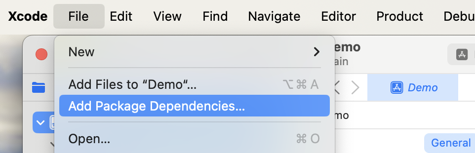
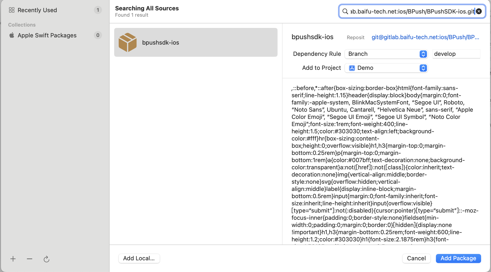
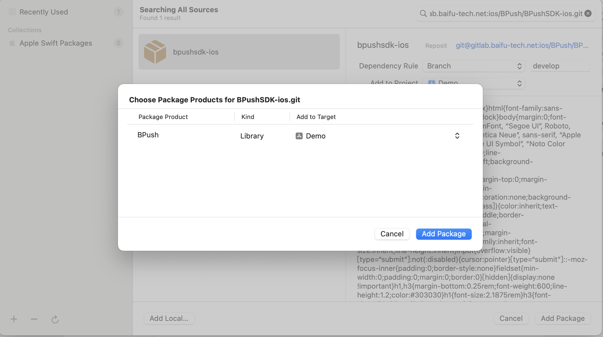
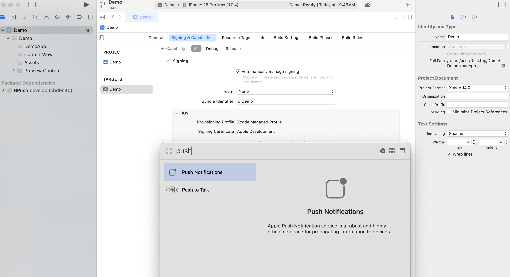

# BPush

## 環境需求
- iOS 15.0 以上
- Xcode 26.3 以上

## 安裝
### Swift Package Manager

* 點選 File > Add Package Dependencies。



* 複製 https://github.com/balvenie-ios/BPushSDK-ios ，將它輸入在 Search or Enter Package URL 的框框裡，選擇 SDK 後點選 Add Package。



* 勾選 BPushSDK-ios 後點選 Add Package，將套件加到專案裡。



> 自 1.3.1 起不再提供 CocoaPods 安裝，請改用 Swift Package Manager。

## 初始化

### 將 target 加入 Push Notification 功能



### 在 AppDelegate 中 import
```swift
import BPush
```

### 在 didFinishLaunchingWithOptions 中呼叫 register 並傳入 AppKey
```swift
func application(_ application: UIApplication, didFinishLaunchingWithOptions launchOptions: [UIApplication.LaunchOptionsKey : Any]? = nil) -> Bool {
    BPush.register(appKey: "Your AppKey") { error in
        // error 為 nil 表示註冊成功，否則可查看失敗原因
        if let error {
            print(error.localizedDescription)
        }
    }
    return true
}
```

### 在 didRegisterForRemoteNotificationsWithDeviceToken 中呼叫 handleDeviceToken 並傳入 deviceToken
```swift
func application(_ application: UIApplication, didRegisterForRemoteNotificationsWithDeviceToken deviceToken: Data) {
    BPush.handleDeviceToken(deviceToken)
}
```

## 錯誤偵測
### 判斷 Token 接收不到的錯誤資訊
```swift
func application(_ application: UIApplication, didFailToRegisterForRemoteNotificationsWithError error: Error) {
    // error 顯示錯誤原因
}
```
